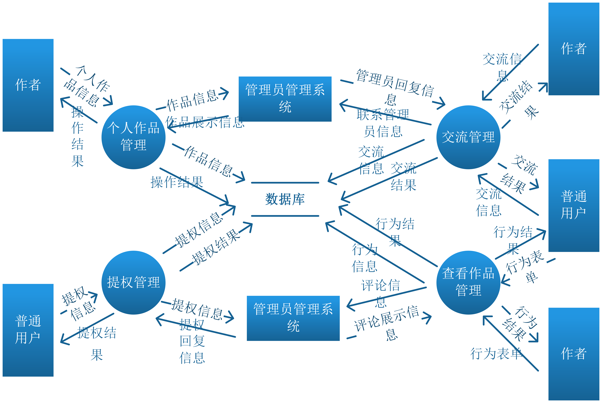
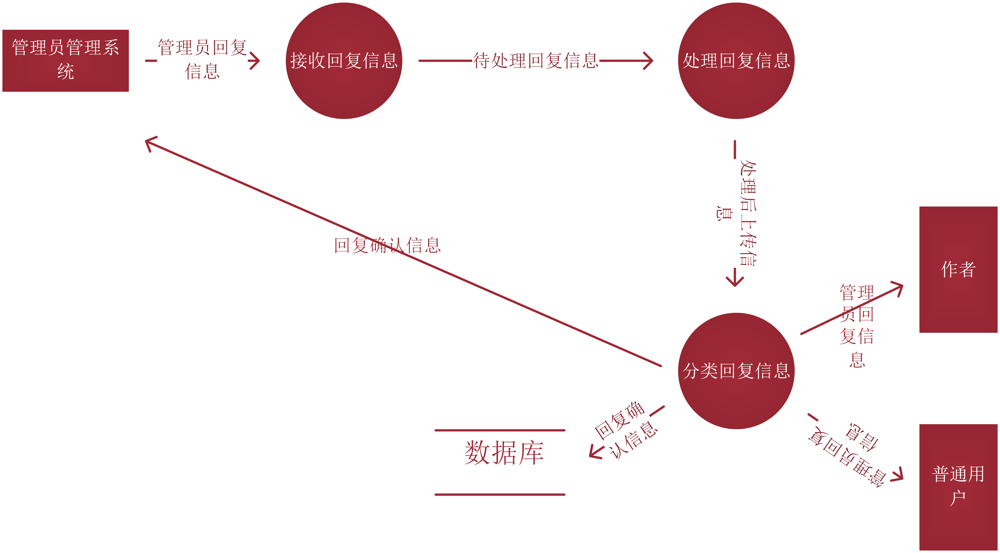

# 艺术作品网站项目后端需求分析

* [功能性需求](#1)
    * [数据流图](#1.1)
        * [I层](#1.1.1)
        * [II层](#1.1.2)
            * [用户管理系统](#1.1.2.1)
            * [管理员管理系统](#1.1.2.2)
            * [艺术作品展示系统](#1.1.2.3)
        * [III层](#1.1.3)
            * [用户登录管理](#1.1.2.1.1)
            * [用户注册管理](#1.1.2.1.2)
            * [用户注销管理](#1.1.2.1.3)
            * [用户资料管理](#1.1.2.1.4)
            * [审核作品管理](#1.1.2.2.1)
            * [审核评论管理](#1.1.2.2.2)
            * [审核提权管理](#1.1.2.2.3)
            * [回复联系管理](#1.1.2.2.4)
            * [交流管理](#1.1.2.3.1)
            * [个人作品管理](#1.1.2.3.2)
            * [查看作品管理](#1.1.2.3.3)
            * [提权管理](#1.1.2.3.4)
        * [IV层](#1.1.4) 
            * [增加资料管理](#1.1.2.1.4.1)
            * [删除资料管理](#1.1.2.1.4.2)
            * [修改资料管理](#1.1.2.1.4.3)
            * [私信管理](#1.1.2.3.1.1)
            * [联系管理员管理](#1.1.2.3.1.2)
            * [修改作品管理](#1.1.2.3.2.1)
            * [删除作品管理](#1.1.2.3.2.2)
            * [上传作品管理](#1.1.2.3.2.3)
            * [点赞管理](#1.1.2.3.3.1)
            * [分享管理](#1.1.2.3.3.2)
            * [关注管理](#1.1.2.3.3.3)
            * [收藏管理](#1.1.2.3.3.4)
            * [查询管理](#1.1.2.3.3.5)
            * [评论管理](#1.1.2.3.3.6)
        * [V层](#1.1.5)
            * [发送联系信息管理](#1.1.2.3.1.2.1)
            * [回复联系信息管理](#1.1.2.3.1.2.2)
    * [部分加工说明](#1.2)
        * [确认注销](#1.2.1)  
        * [完善提权信息](#1.2.2)
        * [处理私信](#1.2.3)
        * [处理上传信息](#1.2.4)
    
    * [数据字典](#1.3)
        * [用户登录](#1.3.1)
            * [1.登录信息](#1.3.1.1)
            * [2.登录结果](#1.3.1.2)
        * [用户注册](#1.3.2)
            * [1.注册信息](#1.3.2.1)
            * [2.注册结果](#1.3.2.2)
        * [用户注销](#1.3.3)
            * [1.注销信息](#1.3.3.1)
            * [2.注销结果](#1.3.3.2)
        * [用户资料管理](#1.3.4)
            * [1.个人信息表单](#1.3.4.1)
            * [2.增加/删除/修改结果](#1.3.4.2)
        * [审核作品](#1.3.5)
            * [1.作品信息](#1.3.5.1)
            * [2.作品展示信息](#1.3.5.2)
            * [3.审核确认](#1.3.5.3)
        * [审核评论](#1.3.6)
            * [1.评论信息](#1.3.6.1)
            * [2.评论展示信息](#1.3.6.2)
            * [3.审核确认](#1.3.6.3)
        * [审核提权](#1.3.7)
            * [1.待审核提权信息](#1.3.7.1)
            * [2.提权回复信息](#1.3.7.2)
            * [3.审核确认](#1.3.7.3)
            * [4.待完善提权](#1.3.7.4)
            * [5.提权结果](#1.3.7.5)
        * [联系管理员](#1.3.8)
            * [1.联系管理员信息](#1.3.8.1)
            * [2.管理员回复信息](#1.3.8.2)
            * [3.回复确认信息](#1.3.8.3)
            * [4.联系确认信息](#1.3.8.4)
        * [私信管理](#1.3.9)
            * [1.私信信息](#1.3.9.1)
            * [2.私信确认信息](#1.3.9.2)
        * [个人作品管理](#1.3.10)
            * [1.修改/删除/上传作品信息](#1.3.10.1)
            * [2.修改/删除/上传结果](#1.3.10.2)
        * [行为管理](#1.3.11)
            * [1.点赞/关注/收藏/分享/查询信息](#1.3.11.1)
            * [2.点赞/关注/收藏/分享/查询结果](#1.3.11.2)
            
<h2 id = "1">功能性需求</h2>
<h3 id = "1.1">数据流图</h3>
<h4 id = "1.1.1">I层</h4>

1. **登录信息** 

2. **注销信息**
3. **个人信息表单**
4. **注册信息**
5. **登录结果**  
6. **注销结果**  
7. **完善结果**  
8. **注册结果**  
9. **个人作品信息**  
10. **交流信息**  
11. **行为表单**  
12. **操作结果**  
13. **交流结果**  
14. **行为结果**  
15. **提权信息**
16. **提权结果**
17. **评论信息**
18. **作品信息**
19. **提权信息**
20. **联系管理员信息**
21. **评论展示信息**
22. **作品展示信息**
23. **提权回复信息**
24. **管理员回复信息**
25. **待审核评论**
26. **待审核作品**
27. **待审核提权信息**
28. **待回复联系信息**
29. **审核确认**
30. **回复信息**  

<h4 id = "1.1.2">II层</h4>
<h5 id = "1.1.2.1">用户管理系统</h5>

<h5 id = "1.1.2.1">管理员管理系统</h5>

<h5 id = "1.1.2.1">艺术作品展示系统</h5>

<h4 id = "1.1.3">III层</h4>
<h5 id = "1.1.2.1.1">用户登录管理</h5>

<h5 id = "1.1.2.1.2">用户注册管理</h5>

<h5 id = "1.1.2.1.3">用户注销管理</h5>

<h5 id = "1.1.2.1.4">用户资料管理</h5>

<h5 id = "1.1.2.2.1">审核作品管理</h5>

<h5 id = "1.1.2.2.2">审核评论管理</h5>

<h5 id = "1.1.2.2.3">审核提权管理</h5>

<h5 id = "1.1.2.2.4">回复联系管理</h5>

<h5 id = "1.1.2.3.1">交流管理</h5>

<h5 id = "1.1.2.3.2">个人作品管理</h5>

<h5 id = "1.1.2.3.3">查看作品管理</h5>

<h5 id = "1.1.2.3.4">提权管理</h5>

<h4 id = "1.1.4">IV层</h4>
<h5 id = "1.1.2.1.4.1">增加资料管理</h5>

<h5 id = "1.1.2.1.4.2">删除资料管理</h5>

<h5 id = "1.1.2.1.4.3">修改资料管理</h5>

<h5 id = "1.1.2.3.1.1">私信管理</h5>

<h5 id = "1.1.2.3.1.2">联系管理员管理</h5>

<h5 id = "1.1.2.3.2.1">修改作品管理</h5>

<h5 id = "1.1.2.3.2.2">删除作品管理</h5>

<h5 id = "1.1.2.3.2.3">上传作品管理</h5>

<h5 id = "1.1.2.3.3.1">点赞管理</h5>

<h5 id = "1.1.2.3.3.2">分享管理</h5>

<h5 id = "1.1.2.3.3.3">关注管理</h5>

<h5 id = "1.1.2.3.3.4">收藏管理</h5>

<h5 id = "1.1.2.3.3.5">查询管理</h5>

<h5 id = "1.1.2.3.3.6">评论管理</h5>

<h4 id = "1.1.5">V层</h4>
<h5 id = "1.1.2.3.1.2.1">发送联系信息管理</h5>

<h5 id = "1.1.2.3.1.2.2">回复联系信息管理</h5>

<h3 id = "1.2">部分加工说明</h3>
<h4 id = "1.2.1">确认注销</h4>

| 加工名称 | 确认注销 | 
| ------------- |:-------------:| 
| 流入数据流 | 待检测注销信息、用户信息 | 
| 流出数据流 | 确认后注销信息  | 
| 处理周期 | 每当用户点击注销时 | 
| 说明     |  确认入库实际是通过数据库传过来的用户信息，查看当前用户状态能否允许注销,经确认后将确认后注销信息传递给执行注销  |

<h4 id = "1.2.2">完善提权信息</h4>

| 加工名称 | 完善提权信息 | 
|-------------|:-------------:| 
| 流入数据流 | 待完善提权信息 | 
| 流出数据流 | 完善后提权信息  | 
| 处理周期 | 每当用户申请提权时 | 
| 说明     | 当申请提权将提权基本信息传递过来时，需要完善提权信息，一般可以通过提供真实资料证明身份或者其他人推举的方式，完善提权信息   |
<h4 id = "1.2.3">处理私信</h4>

| 加工名称 | 处理私信 | 
| ----------------- |:-------------:| 
| 流入数据流 | 待处理私信信息 | 
| 流出数据流 | 分类后私信信息  | 
| 处理周期 | 每当用户发送私信时 | 
| 说明     |  处理私信实际是将待处理的私信信息进行分类，传递给接下来的加工  |

<h4 id = "1.2.4">处理上传信息</h4>

| 加工名称 | 处理上传信息 | 
| ------------------ |:-------------:| 
| 流入数据流 | 待上传作品信息 | 
| 流出数据流 | 处理后上传信息、上传作品信息  | 
| 处理周期 | 每当作者点击上传时 | 
| 说明     |  当用户将待上传作品信息传递来时，先进行分类处理，其次按一定的算法均衡的分发给管理员们 |

<h3 id = "1.3">数据字典</h3>
<h4 id = "1.3.1">用户登录</h4>
<h5 id = "1.3.1.1">1.登录信息</h5>

| 名称 | 登录信息(待检测登录信息) | 
| ------------------ |:-------------:| 
| 描述 | 从用户表单获取的登录信息 | 
| 来源 | 用户输入采集  | 
| 去处 | 身份验证 | 
| 组成 | {登录号}+{用户名}+{密码}+{验证码}+{登录时间}+{登录地点}+{标记1(标记说明是否经过身份验证)}+{标记2(标记说明是否登录成功)}|
<h5 id = "1.3.1.2">2.登录结果</h5>

| 名称 | 登录结果(检测后登录信息) | 
| ------------------ |:-------------:| 
| 描述 | 经过数据库确认的登录信息 | 
| 来源 | 身份验证  | 
| 去处 | 确认登录 | 
| 组成 | {登录号}+{用户id(注册时的)}+{登录时间}+{登录地点}|
<h4 id = "1.3.2">用户注册</h4>
<h5 id = "1.3.2.1">1.注册信息</h5>

| 名称 | 注册信息(待检测注册信息) | 
| ------------------ |:-------------:| 
| 描述 | 从用户表单获取的注册信息 | 
| 来源 | 用户输入采集  | 
| 去处 | 确认注册 | 
| 组成 | {注册号}+{用户名}+{密码}+{验证码}+{邮箱}+{注册时间}+{注册地点}+{标记1(标记说明是否经过确认)}+标记2(标记说明是否注册成功) |

<h5 id = "1.3.2.2">2.注册结果</h5>

| 名称 | 注册结果(确认后注册信息) | 
| ------------------ |:-------------:| 
| 描述 | 从数据库确认的注册信息 | 
| 来源 | 确认注册  | 
| 去处 | 执行注册 | 
| 组成 | {用户id}+{用户名}+{密码}+{邮箱}+{注册时间}+{注册地点} |
<h4 id = "1.3.3">用户注销</h4>
<h5 id = "1.3.3.1">1.注销信息</h5>

| 名称 | 注销信息(待检测注销信息) | 
| ------------------ |:-------------:| 
| 描述 | 从用户触发事件获取的注销信息 | 
| 来源 | 用户触发事件采集  | 
| 去处 | 确认注销 | 
| 组成 | {注销号}+{用户id}+{用户名}+{状态}+{标记(标记说明是否经过确认)} |

<h5 id = "1.3.3.2">2.注销结果</h5>

| 名称 | 注销结果(确认后注销信息) | 
| ------------------ |:-------------:| 
| 描述 | 经过状态检测的注销信息 | 
| 来源 | 确认注销  | 
| 去处 | 执行注销 | 
| 组成 | {注销号}+{用户id}+{用户名}+{标记(标记说明是否注销成功)} |

<h4 id = "1.3.4">用户资料管理</h4>
<h5 id = "1.3.4.1">1.个人信息表单</h5>

| 名称 | 个人信息表单(待检测/确认个人信息)| 
| ------------------ |:-------------:| 
| 描述 | 从用户触发事件获取的增加/删除/修改个人信息 | 
| 来源 | 用户触发事件采集  | 
| 去处 | 确认增加/删除/修改 | 
| 组成 | {增加/删除/修改号}+{用户id}+{用户名}+{增加/删除/修改信息}+{标记(标记说明是否已经增加/删除/修改)} |

<h5 id = "1.3.4.2">2.增加/删除/修改结果</h5>

| 名称 | 增加/删除/修改结果| 
| ------------------ |:-------------:| 
| 描述 | 经过确认后的个人信息表单 | 
| 来源 | 确认增加/删除/修改  | 
| 去处 | 执行增加/删除/修改 | 
| 组成 | {增加/删除/修改号}+{用户id}+{用户名}+{增加/删除/修改信息}+{标记(标记说明是否增加/删除/修改成功)} |

<h4 id = "1.3.5">审核作品</h4>
<h5 id = "1.3.5.1">1.作品信息</h5>

| 名称 | 作品信息(待审核作品信息/处理后上传信息) | 
| ------------------ |:-------------:| 
| 描述 | 作者提交的作品信息 | 
| 来源 | 艺术作品展示系统  | 
| 去处 | 确认审核 | 
| 组成 | {审核号}+{作品编号}+{作品名}+{用户id}+{用户名}+{上传时间}+{作品类别}+{标记(标记说明是否经过审核)} |

<h5 id = "1.3.5.2">2.作品展示信息</h5>

| 名称 | 作品展示信息(审核后作品信息) | 
| ------------------ |:-------------:| 
| 描述 | 经过审核后的作品信息| 
| 来源 | 确认审核 | 
| 去处 | 提交审核 | 
| 组成 | {审核号}+{作品编号}+{作品名}+{用户id}+{用户名}+{上传时间}+{作品类别}+{点赞信息}+{评论信息}+{分享信息}+{收藏信息}+{标记(标记说明审核通过)} |

<h5 id = "1.3.5.3">3.审核确认</h5>

| 名称 | 审核确认 | 
| ------------------ |:-------------:| 
| 描述 | 经过管理员审核的确认信息 | 
| 来源 | 管理员  | 
| 去处 | 确认审核 | 
| 组成 | {审核号}+{作品编号}+{用户id} |

<h4 id = "1.3.6">审核评论</h4>
<h5 id = "1.3.6.1">1.评论信息</h5>

| 名称 | 评论信息(待审核评论) | 
| ------------------ |:-------------:| 
| 描述 | 未经过审核的评论信息 | 
| 来源 | 艺术作品展示系统  | 
| 去处 | 确认审核 | 
| 组成 | {审核号}+{用户id}+{用户名}+{评论内容}+{评论编号}+{作品编号}+{标记(标记说明是否经过审核)} |

<h5 id = "1.3.6.2">2.评论展示信息</h5>

| 名称 | 评论展示信息(审核后评论) | 
| ------------------ |:-------------:| 
| 描述 | 经过审核后的评论信息 | 
| 来源 | 确认审核  | 
| 去处 | 提交审核 | 
| 组成 | {审核号}+{用户id}+{用户名}+{评论内容}+{评论编号}+{作品编号}+{标记(标记说明是否审核通过)} |

<h5 id = "1.3.6.3">3.审核确认</h5>

| 名称 | 审核确认 | 
| ------------------ |:-------------:| 
| 描述 | 经过管理员审核的确认信息 | 
| 来源 | 管理员  | 
| 去处 | 确认审核 | 
| 组成 | {审核号}+{评论编号}+{用户id}+{作品编号} |

<h4 id = "1.3.7">审核提权</h4>
<h5 id = "1.3.7.1">1.待审核提权信息</h5>

| 名称 | 待审核提权信息(完善后提权) | 
| ------------------ |:-------------:| 
| 描述 | 完善后但未经过审核的提权信息 | 
| 来源 | 艺术作品展示系统  | 
| 去处 | 确认审核 | 
| 组成 | {提权号}+{用户id}+{用户名}+{提权资料}+{标记(标记说明是否经过审核)} |

<h5 id = "1.3.7.2">2.提权回复信息</h5>

| 名称 | 提权回复信息(审核后提权) | 
| ------------------ |:-------------:| 
| 描述 | 经过审核后的提权信息 | 
| 来源 | 确认审核  | 
| 去处 | 提交审核 | 
| 组成 | {审核号}+{用户id}+{用户名}+{标记(标记说明是否审核通过)} |

<h5 id = "1.3.7.3">3.审核确认</h5>

| 名称 | 审核确认 | 
| ------------------ |:-------------:| 
| 描述 | 经过管理员审核的确认信息 | 
| 来源 | 管理员  | 
| 去处 | 确认审核 | 
| 组成 | {审核号}+{用户id} |

<h5 id = "1.3.7.4">4.待完善提权</h5>

| 名称 | 待完善提权(提权信息) | 
| ------------------ |:-------------:| 
| 描述 | 用户发起的提权选择 | 
| 来源 | 普通用户的点击  | 
| 去处 | 完善提权信息 | 
| 组成 | {提权号}+{用户id}+{标记(是否经过完善)} |

<h5 id = "1.3.7.5">5.提权结果</h5>

| 名称 | 提权结果(提权回复信息) | 
| ------------------ |:-------------:| 
| 描述 | 提权是否成功的反馈 | 
| 来源 | 反馈提权结果  | 
| 去处 | 普通用户 | 
| 组成 | {提权号}+{审核号}+{用户id} |

<h4 id = "1.3.8">联系管理员</h4>
<h5 id = "1.3.8.1">1.联系管理员信息</h5>

| 名称 | 联系管理员信息(待回复联系信息) | 
| ------------------ |:-------------:| 
| 描述 | 用户联系管理员的信息 | 
| 来源 | 艺术作品展示系统  | 
| 去处 | 处理回复信息 | 
| 组成 | {信息编号}+{用户id}+{信息内容}+{标记(标记说明是否回复)} |

<h5 id = "1.3.8.2">2.管理员回复信息</h5>

| 名称 | 管理员回复信息(回复信息/最终回复信息) | 
| ------------------ |:-------------:| 
| 描述 | 管理员回复用户的信息 | 
| 来源 | 管理员管理系统  | 
| 去处 | 处理回复信息 | 
| 组成 | {信息编号}+{用户id}+{用户名}+{标记是否确认} |

<h5 id = "1.3.8.3">3.回复确认信息</h5>

| 名称 | 回复确认信息 | 
| ------------------ |:-------------:| 
| 描述 | 管理员回复用户得到系统的确认 | 
| 来源 | 分类回复信息  | 
| 去处 | 管理员管理系统 | 
| 组成 | {信息编号}+{用户id}+{确认号} |

<h5 id = "1.3.8.4">4.联系确认信息</h5>

| 名称 | 联系确认信息 | 
| ------------------ |:-------------:| 
| 描述 | 用户联系管理员反馈的确认到达信息 | 
| 来源 | 分发联系信息  | 
| 去处 | 作者、普通用户 | 
| 组成 | {信息编号}+{用户id}+{用户名}+{确认号} |

<h4 id = "1.3.9">私信管理</h4>
<h5 id = "1.3.9.1">1.私信信息</h5>

| 名称 | 私信信息(待处理私信信息) | 
| ------------------ |:-------------:| 
| 描述 | 用户之间相互发送的私密信息 | 
| 来源 | 作者、普通用户  | 
| 去处 | 处理私信 | 
| 组成 | {私信编号}+{用户id}+{目的用户id}+{私信内容}+{标记(标记说明是否经过处理)} |

<h5 id = "1.3.9.2">2.私信确认信息</h5>

| 名称 | 私信确认信息 | 
| ------------------ |:-------------:| 
| 描述 | 用户发送私密信息的确认 | 
| 来源 | 反馈确认  | 
| 去处 | 作者、普通用户 | 
| 组成 | {私信编号}+{用户id}+{目的用户id}+{确认号} |

<h4 id = "1.3.10">个人作品管理</h4>
<h5 id = "1.3.10.1">1.修改/删除/上传作品信息</h5>

| 名称 | 修改/删除/上传作品信息 | 
| ------------------ |:-------------:| 
| 描述 | 作者对于作品的修改/删除/上传信息| 
| 来源 | 作者  | 
| 去处 | 处理修改/删除/上传信息 | 
| 组成 | {修改/删除/上传编号}+{作者id}+{作者用户名}+{作品编号}+{修改/删除/上传内容} |

<h5 id = "1.3.10.2">2.修改/删除/上传结果</h5>

| 名称 | 修改/删除/上传结果(处理后修改/删除/上传信息) | 
| ------------------ |:-------------:| 
| 描述 | 处理后的修改/删除/上传信息 | 
| 来源 | 提交修改/删除/上传信息  | 
| 去处 | 作者 | 
| 组成 | {修改/删除/上传编号}+{作者id}+{作者用户名}+{作品编号}+{标记(是否修改/删除/上传成功) |

<h4 id = "1.3.11">行为管理</h4>
<h5 id = "1.3.11.1">1.点赞/关注/收藏/分享/查询信息</h5>

| 名称 | 点赞/关注/收藏/分享/查询信息(待处理点赞/关注/收藏/分享/查询信息) | 
| ------------------ |:-------------:| 
| 描述 | 用户的行为信息 | 
| 来源 | 作者、普通用户  | 
| 去处 | 处理点赞/关注/收藏/分享/查询信息 | 
| 组成 | {点赞/关注/收藏/分享/查询编号}+{用户id}+{作品编号}+{点赞/关注/收藏/分享/查询个数} |

<h5 id = "1.3.11.2">2.点赞/关注/收藏/分享/查询结果</h5>

| 名称 | 点赞/关注/收藏/分享/查询结果(处理后点赞/关注/收藏/分享/查询信息) | 
| ------------------ |:-------------:| 
| 描述 | 用户行为的结果 | 
| 来源 | 提交点赞/关注/收藏/分享/查询信息 | 
| 去处 | 作者、普通结果 | 
| 组成 | {点赞/关注/收藏/分享/查询编号}+{用户id}+{作品编号}+{点赞/关注/收藏/分享/查询个数}+{标记(是否点赞/关注/收藏/分享/查询成功)} |

